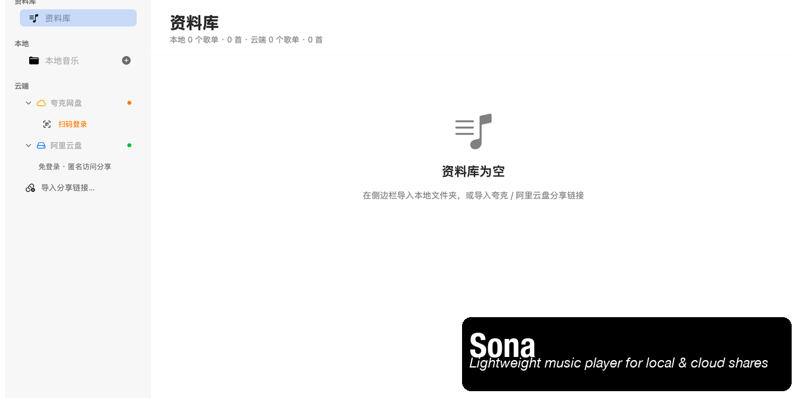
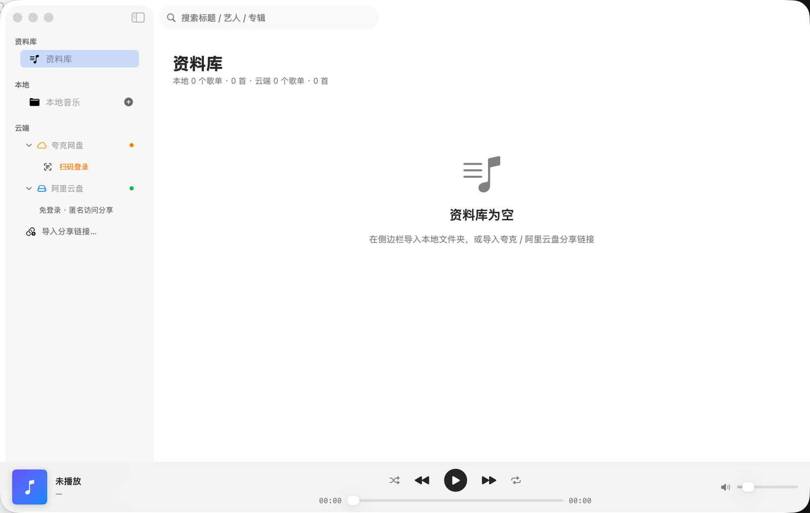

# Sona

<div align="center">

** macOS 原生音乐播放器 · 本地音乐 + 云端网盘聚合 **

[](https://developer.apple.com/macos/)
[](https://swift.org)
[](https://developer.apple.com/xcode/swiftui/)
[](LICENSE)
[](#工程结构)

中文 · [贡献指南](CONTRIBUTING.md) · [更新日志](CHANGELOG.md) · [行为准则](CODE_OF_CONDUCT.md)

</div>

<div align="center">
  
</div>

<br/>

<div align="center">
  
  <br/>
  <sub>侧边栏「云端」聚合夸克网盘与阿里云盘分享，支持免登录匿名访问</sub>
</div>

---

## 这是什么

Sona 是一款为 macOS 打造的桌面音乐播放器，用 **纯 SwiftUI + AVFoundation** 写成，**零第三方依赖**。

它解决一个很具体的痛点：**你的音乐散落在本地硬盘和各种网盘分享链接里**。Sona 把本地文件夹和云端网盘（夸克、阿里云盘）聚合成统一的音乐库，点开就能听 —— 网盘的歌也能像本地文件一样随意拖动进度条。

> 名字取自 **So**und + So**na**r（声纳）：像声纳一样，把散落各处的声音找回来。

## 特性

**本地音乐**
- 通过 Security-Scoped Bookmark 持久化目录授权，重启后自动恢复
- 异步提取 ID3 标签（标题 / 艺人 / 专辑 / 内嵌封面 / 时长）
- 支持 mp3、m4a、flac、wav、aiff、aac、ogg、opus 等常见格式

**云端网盘**
- 侧边栏「云端」按网盘分组，可折叠，歌单以分享标题命名
- 支持**多次导入**，每次导入生成独立歌单
- 粘贴分享文本后**自动识别网盘来源**，无需手动选择
- 播放时才解析直链（避免直链过期与登录态失效）

**播放体验**
- 内置本地流媒体代理（`127.0.0.1`），解决云盘直链防盗链 403 与进度拖拽
- 联动 macOS 控制中心、锁屏界面与媒体键（`MPNowPlayingInfoCenter`）
- 封面驱动的动态氛围泛光背景
- 快捷键：`空格` 播放/暂停 · `Cmd + ←/→` 切歌 · `Cmd + O` 导入文件夹 · `Cmd + Shift + I` 导入云端分享

## 快速开始

### 方式一：下载预编译版本

从 [Releases](https://github.com/Paul-liu/Sona/releases) 下载 `Sona.app.zip`，解压后拖入应用程序文件夹。

> **首次打开提示处理**：本 App 使用 ad-hoc 签名（本地构建、未做 Apple 公证），
> 从浏览器下载后 macOS 的 Gatekeeper 会提示 **「无法验证开发者」** 并默认阻止打开。
> 这是正常的，按下面任一方式放行即可（每个新版本只需操作一次）：
>
> - **方式 A（推荐）**：在 Finder 中**右键点击 `Sona.app` → 选择「打开」** → 在弹窗中点「打开」；
> - **方式 B**：打开 **系统设置 → 隐私与安全性**，在页面下方找到 Sona 的拦截记录，点 **「仍要打开」**；
>
> 若仍被阻止，可在「隐私与安全性」中确认是否误选了「App Store 和被认可的开发者」之外的严格选项，
> 或到 [Issues](https://github.com/Paul-liu/Sona/issues) 反馈你的 macOS 版本与报错截图。

### 方式二：从源码构建

```bash
git clone https://github.com/Paul-liu/Sona.git
cd Sona
swift run Sona
```

生产构建：

```bash
swift build -c release
```

> 若遇到 `sandbox-exec: sandbox_apply: Operation not permitted`，加 `--disable-sandbox` 参数即可：
> ```bash
> swift build -c release --disable-sandbox
> ```

环境要求：**macOS 13.0+** / **Swift 5.9+**（Xcode 15 及以上附带）。

## 使用说明

### 导入本地音乐

点击侧边栏「本地音乐」右侧的 `+`，或按 `Cmd + O`，选择包含音频的目录。Sona 会以**文件夹名**创建独立歌单，多次导入会形成多个歌单。

### 导入云端分享

1. 点击侧边栏底部的「导入分享链接…」
2. 粘贴网盘 App 复制的整段文本（含链接和提取码也没关系）
3. Sona 自动识别网盘类型并导入，生成以分享标题命名的歌单

目前支持：

| 网盘 | 登录要求 | 支持形式 |
| --- | --- | --- |
| 夸克网盘 | 需扫码登录 | `pan.quark.cn/s/xxx`、短链 `/~xxx~/`、带/不带提取码 |
| 阿里云盘 | **免登录**（分享匿名访问） | `alipan.com/s/xxx`、`aliyundrive.com/s/xxx`、带/不带提取码 |

### 添加新网盘

云端模块是数据驱动的，接入一个新网盘只需要三步：

1. 在 `CloudKind` 枚举（见 `SidebarView.swift`）加一个 case，填写名称、图标、主题色
2. 新建 `XxxShareService`，实现解析链接 → 换取凭据 → 列举文件 → 获取直链
3. 在 `SidebarView.playlists(for:)` 加一个分支返回该网盘的歌单

侧边栏分组、展开折叠、状态显示会自动适配。欢迎提交 PR！

## 工程结构

```
Sona/
├── Package.swift
├── Sources/Sona/
│   ├── App/
│   │   ├── SonaApp.swift              # 应用入口、菜单与快捷键
│   │   └── Info.plist
│   ├── Models/
│   │   ├── Track.swift                # 单曲模型（本地 / 夸克 / 阿里云盘通用）
│   │   ├── Playlist.swift             # 歌单模型
│   │   ├── QuarkModels.swift          # 夸克 API 模型
│   │   └── AliyunModels.swift         # 阿里云盘 API 模型
│   ├── Services/
│   │   ├── AudioPlayerService.swift   # AVPlayer 引擎 + 系统控制中心联动
│   │   ├── LocalLibraryService.swift  # 本地扫描、沙盒书签、ID3 元数据
│   │   ├── LocalStreamProxy.swift     # Network.framework 本地代理（防 403 / 支持 Seek）
│   │   ├── QuarkAuthService.swift     # 夸克登录与 Cookie 管理
│   │   ├── QuarkShareService.swift    # 夸克分享解析与直链获取
│   │   ├── AliyunShareService.swift   # 阿里云盘分享解析（匿名访问）
│   │   └── ToastService.swift         # 轻量提示
│   └── Views/
│       ├── MainWindowView.swift       # NavigationSplitView 主窗口与搜索
│       ├── SidebarView.swift          # 侧边栏导航（云端按网盘分组）
│       ├── CloudImportSheet.swift     # 云端分享导入（自动识别来源）
│       ├── QuarkLoginSheet.swift      # 夸克扫码登录
│       ├── LibrarySectionView.swift   # 资料库分栏
│       ├── TrackListView.swift        # 歌曲列表
│       └── PlayerBarView.swift        # 底部播放条
├── Scripts/IconGen.swift              # App 图标生成脚本
└── Assets/                            # 图标资源
```

设计语言与视觉规范见 [DESIGN.md](DESIGN.md)。

## 排障

导入失败时，Sona 会把完整请求过程写入诊断日志，提交 Issue 时请一并提供：

```bash
# 夸克
tail -50 /tmp/sona_quark_import.log

# 阿里云盘
tail -50 /tmp/sona_aliyun_import.log
```

**常见问题**

| 现象 | 原因与处理 |
| --- | --- |
| 夸克播放失败 / 提示重新登录 | 登录态过期（直链降级为游客链被 CDN 拒绝）。侧边栏退出登录后重新扫码 |
| 夸克导入报 `14001 非法 token` | 分享链接的 Referer 校验。已在 v1.0.10 修复，请更新到最新版 |
| 阿里云盘导入报 `HTTP 429` | 触发平台限流。v1.1.3 起会自动退避重试（5s / 10s / 15s） |
| 提示「分享中没有音频文件」 | 该分享目录下确实没有音频，或全部为不支持的格式 |

## 贡献

欢迎任何形式的贡献 —— 修 Bug、加网盘、改进 UI、完善文档。请先阅读 [CONTRIBUTING.md](CONTRIBUTING.md)。

首次贡献者可以从这些 [Good First Issues](https://github.com/Paul-liu/Sona/labels/good%20first%20issue) 入手。

## 路线图

- [ ] 自定义歌单（拖拽排序 / 重命名 / 合并）
- [ ] 桌面歌词（LRC 解析与逐行高亮）
- [ ] 接入更多网盘（百度网盘、115、OneDrive）
- [ ] 歌单持久化（当前重启后需重新导入）
- [ ] 全局快捷键（无焦点时仍可控制）
- [ ] AirPlay / 输出设备切换

欢迎在 [Discussions](https://github.com/Paul-liu/Sona/discussions) 里投票或提议。

## 免责声明

- 本项目为**个人学习与技术研究**用途开发的开源软件，不属于夸克、阿里云盘或任何其他平台的官方产品，与相关公司无任何关联。
- 项目中的云端功能**仅调用各平台公开可访问的 Web 接口**，不包含任何破解、逆向或绕过付费授权的代码。
- 请遵守各网盘的《服务条款》，**仅播放你有权访问的内容**，勿用于批量下载、分发或任何商业用途。
- 用户因使用本项目产生的任何后果由使用者自行承担，项目作者与贡献者不承担任何责任。
- 若你是相关平台方且认为本项目存在不当之处，请通过 Issue 联系，我们会积极配合处理。

## 许可证

基于 [MIT License](LICENSE) 开源 —— 你可以自由使用、修改和分发，包括商业用途，只需保留版权声明。

---

<div align="center">

Built with Swift & SwiftUI · 如果这个项目帮到了你，欢迎点个 ⭐

</div>
